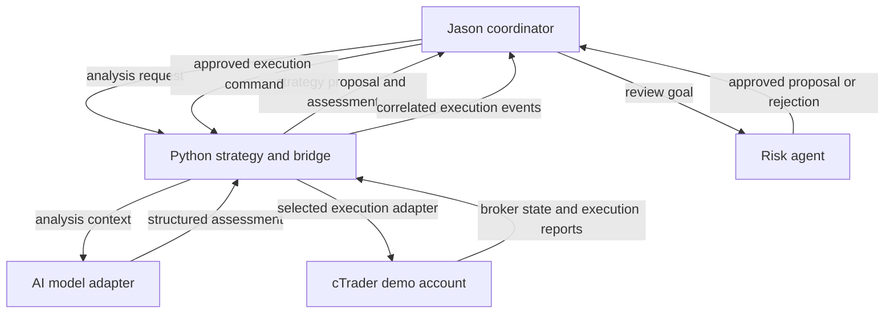

# Advanced Demo: Jason + Python + AI + cTrader

**Status: design and learning target.** The external adapters and integrated trading application have not been implemented. For the current executable teaching example, start with [Lesson 6](../lessons/06-trading-coordination/README.md).

## Demonstration Goal

Show a complete trading workflow whose participants collaborate, respond to new information, and handle failure. Python reuses the existing strategy project, an AI model supplies structured analysis, Jason coordinates goals and commitments, and a cTrader adapter carries out approved commands on a demo account.

## Proposed Architecture

All arrows are planned interfaces, not working integrations in this repository. The Python strategy project and the AI model are collaborators with different roles. An AI assessment is advisory input; the final command must satisfy deterministic validation and execution rules.

## Responsibilities

| Component | Owns |
| --- | --- |
| Jason coordinator | Analysis/execution goals, scenario progression, cancellation and recovery decisions |
| Python strategy adapter | Existing indicators, strategy logic and market-data processing |
| AI adapter | Structured assessment, response validation, deadlines and fixture mode |
| Risk agent plus execution-boundary checks | Review of proposals and revalidation immediately before execution |
| cTrader execution adapter | Broker symbol/volume conventions, submission, acknowledgements and position queries |
| Event trace | Correlation IDs and the reason for each state transition |

Use one component to own each responsibility. Preserve the existing cBot's protective position management where appropriate; do not introduce a second competing position manager.

## BDI Applied to the Demo

- **Beliefs:** the latest quote and its age, account state, current positions, strategy proposal, AI assessment, connection state, and order status.
- **Goals:** evaluate an opportunity, execute an approved proposal, obtain an execution result, reconcile an uncertain result, or cancel a pending task.
- **Plans:** proceed with usable analysis; hold or reject when inputs are invalid; query state after an uncertain submission; suspend pending work on a connection problem.
- **Intentions:** the specific analysis, execution, or recovery task currently being pursued.

The AI model does not automatically supply BDI semantics. Jason's plans define how the system uses its output.

## Example Walkthrough

1. A recorded or demo-account bar reaches the Python bridge.
2. The strategy adapter computes features and returns a proposal.
3. The AI adapter returns a structured assessment, or a distinct timeout/invalid-response result.
4. Jason receives correlated facts and requests risk evaluation.
5. A passing result leads to an execution command; a rejection ends that proposal.
6. The adapter checks account mode, proposal freshness, broker constraints, and duplicate identity before submission.
7. A broker execution report becomes an event that updates Jason's beliefs.
8. If submission times out, Jason starts a reconciliation goal. It does not assume the order was rejected.

In replay mode, every external participant is replaced with a deterministic fixture so the same scenario can be reproduced.

## Acceptance Scenarios

| Scenario | Observable outcome |
| --- | --- |
| Valid proposal | One paper or demo-account command, with a correlated execution result |
| Risk condition fails | Rejection reason and no order submission |
| Invalid AI response | No approved command; explicit invalid-response event |
| AI timeout or late reply | Deadline outcome; late analysis cannot revive an expired proposal |
| Cancellation before submission | Pending intention ends and the bridge refuses the cancelled command |
| Duplicate request | The same logical order is not submitted again |
| Execution acknowledgement missing | Unknown state, then an explicit reconciliation result |
| Connection lost | Pending execution is suspended; conditions are rechecked after reconnect |
| Existing position-management event | One responsible manager handles it and reports the state change |

A demonstration is complete when these behaviours are visible in the event trace and Jason's state inspection. An open order alone does not satisfy the learning objective.

## Implementation Boundaries

Start with fixtures and paper execution, then connect a cTrader demo account. This repository update does not contain credentials, connect to a trading account, select a real AI provider, or modify the user's existing Python project.

The first broker adapter will target either the existing C# cBot bridge or cTrader Open API after inspecting the existing code. Order IDs and reconnect reconciliation must be designed for that chosen path; a JSON correlation ID alone does not guarantee broker-level idempotency.

## Next Steps

Follow [the roadmap](../docs/ROADMAP.md). Review [the proposed contracts](contracts/README.md) before writing any adapters.
